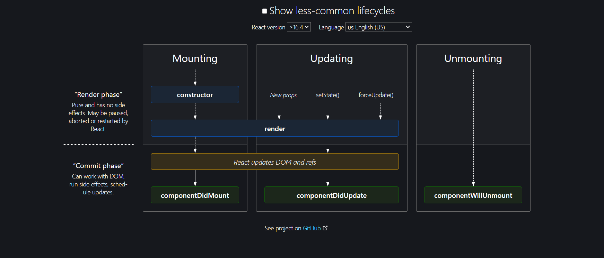

# Ashutosh-React

# Static Program

<!-- // const heading = document.createElement("h2");
// heading.innerHTML = "Hello World From Dynamic";

// const Root = document.getElementById("root1");
// Root.appendChild(heading);

// const heading1 = React.createElement(
// "h1",
// { id: "head" }, // -- Attribute
// "Hello World From React by ash" // -- inner HTML
// );
// console.log(heading1);

// 

// 

// <h1>Hello HTML</h1>
// <h1>Hello JS</h1>
// 

// 

// <h1>Hello React</h1>
// 

// 
;

// const parent = React.createElement("div", { id: "Parent" }, [
// // div 1
// React.createElement("div", { id: "child1" }, [
// React.createElement("h1", { class: "head1" }, "Hello World from HTML"),
// React.createElement("h2", { class: "head2" }, "Hello World from JS"),
// ]),

// // div 2
// React.createElement("div", { id: "child2" }, [
// React.createElement("h3", { class: "head3" }, "Hello World from React"),
// ]),
// ]); -->

# Dynamic Program

# React CDN Program

# cdn --> Content Delivery Network

# Bundlers --> A bundler is a tool that bundles our app, packages our app so that it can be shipped to production.

# steps to install the parcel bundler

    * Package Manager:
        Bundlers are packages. If we want to use a package in our code, we have to use a package manager.
        We use a package manager known as npm

    * NPM : Node Package Manager is a standard repository for all the packages.it's biggest package manager

    *  Configuring the Project:
        -- npm init            -- we get package.json. it initialize the project.
        It creates a package.json file.
        Paackage.json contains metadata about the project and its dependencies, scripts, and other configuration settings
        Now to install parcel we will do:

        -- npm install -D parcel            --> -D for Development Dependencies
        Now we will get a package-lock.json file.
        package-lock.json : Package-lock.json locks the exact version of packages being used in the project.

# ONE QUESTION FOR YOU :- What is difference between package.json and package-lock.json..?

package.json: This file is primarily used for managing and documenting metadata about the project, including its name, version, author, dependencies, scripts, and other configuration details. It acts as a manifest for the project.

package-lock.json: This file is generated and updated automatically by npm when installing or updating packages. It is used to lock the exact versions of dependencies installed in the project, ensuring reproducibility and consistent installations across different environments.

    * To host on Local Server the command will be:
        -- npx parcel index.html
        this command host our website on local server

    * To make our App For production Ready :
        -- npx parcel build index.html
        this command create the dist folder which we can host on the servers

# Let's Talk About JSX (Javascript XML)

    * Javascript XML :- it's merger of HTML and Javascript to make it simple and readable code. it can be multiple lines of Code.
    const heading = <h1>Hello World</h1>        -- JSX

# Let's Talk About Component:

    * Component : Header,footer,body,Aside,Button etc these are the reusable components in react. but the right meaning of component :it's javscript function which return some piece or some lines of JSX.

# There are two types of Exports and Imports

    -- Defualt export
        export default const heading = () =>{
            return (

            )
        }

    -- Named export
        export const CDN = "https://google.com"

    Same in case of Imports

# Components:-

    * Let you break up the user interface into separate pieces that can then be reused and handled independently.

    * There are two types of Components in React
        1) Functional Component
        2) Class Component

    * FUNCTIONAL COMPONENTS (stateless)
        1. functional components are basic javascript functions.these are typically arrow functions but can also be created with the regular function keyword.
        2. React lifecycle methods (for example,componentDidMount) cannot be used in functional components
        3. there is no render method used in functional components.
        4. these are mainly responsible for Ui and are typically presentational only.(for example a Buton Component).
        5. functional components can accept and use props.
                        Functional Component:
                        const App1 = () =>{
                            return(
                                <>
                                    <h1>Hello Function Components</h1>
                                </>
                            )
                        }

                        export default App1;

    * CLASS COMPONENTS (statefull)
        1. class components make use of ES6 class and extend the component class in React.
        2. Sometimes called "Statefull" components as we can implement logic and state.
        3. React Lifecycle Methods can be used inside class components for example (componentDidMount).
        4. we can pass props down to class component and access then, by using this.props.
                        Class Components:
                        class App extends React.Component {
                            render() {
                                return (
                                <>
                                    <h1>Hello Class Components</h1>
                                </>
                                );
                            }
                            }

                            export default App;

# Props And State

    * Props : Properties
        1. Props get passed to the components
        2. Props are immutable
        3. (Props) --> Functional
        4. this.props  -->  Class

    * State : refers to a special object that holds data or information about the component that can change over time. This state determines how the component renders and behaves
        1. state is managed with in the state
        2. state can be changed
        3. useState hook --> Functional component
        4. this.state ---> Class component

# what is difference between stateless(function comp) and statefull(class comp)

    State Management:
    Stateless: Does not manage state. Relies entirely on props.
    Stateful: Manages its own state internally and can update the state over time.

    Complexity:
    Stateless: Simpler, primarily focused on UI rendering.
    Stateful: More complex, handling state, events, and possibly side effects.

    Lifecycle Methods:
    Stateless: No lifecycle methods (though hooks can provide similar capabilities in functional components).
    Stateful: Has lifecycle methods (in class components) like componentDidMount, componentDidUpdate, and componentWillUnmount.

    Performance:
    Stateless: Can be more performant due to lack of state and lifecycle methods.
    Stateful: Might have more overhead due to state management and lifecycle meth

# React LifeCycle in Class Component (stateFull)
